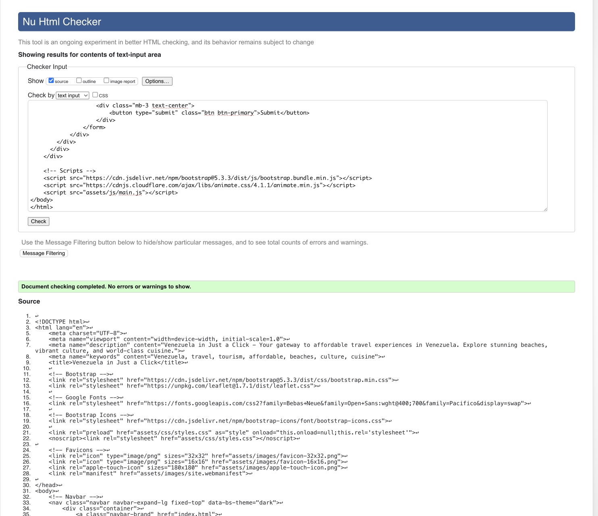
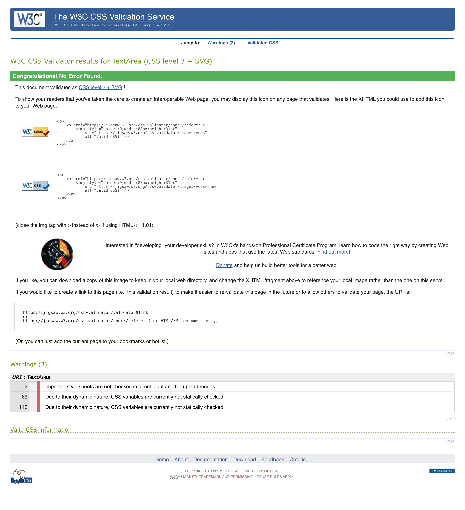
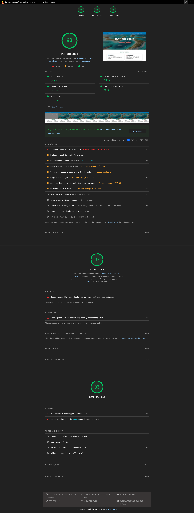

# Venezuela-in-just-a-click
Welcome to **Venezuela in Just a Click**, a vibrant and visually captivating website designed to showcase the beauty, culture, and travel opportunities of Venezuela. This project highlights the country's breathtaking landscapes, rich traditions, and exclusive travel deals, making it the perfect platform for anyone planning their dream trip to Venezuela.

## Table of Contents
- [Homepage](#homepage)
- [About Page](#about-page)
- [Deals Page](#deals-page)
- [Safety Page](#safety-page)
- [Contact Page](#contact-page)
- [Responsive Design](#responsive-design)
- [Testing](#testing)

## 🌟 Features

### 1. **Home Page**
   - A stunning hero section with a call-to-action to plan your dream trip.
   - Highlights of Venezuela's top attractions, including beaches, the Amazon rainforest, world-class cuisine, and cultural experiences.
   - Testimonials from travelers who have explored Venezuela.

### 2. **About Page**
   - A detailed introduction to Venezuela's natural wonders, cultural heritage, and gastronomy.
   - Sections on music, festivals, and traditional foods like arepas and pabellón criollo.
   - Information about unique phenomena like the Catatumbo Lightning.
   

### 3. **Deals Page**
   - Exclusive travel packages for beaches, mountains, deserts, and the Amazon.
   - All-in-one packages for a complete Venezuelan experience.
   - Pricing and booking options for each destination.

### 4. **Safety Page**
   - Information on safety protocols, verified guides, and travel insurance.
   - Tips for secure travel, including planning routes and staying connected.
   - Guidance on health protocols and visa assistance.

### 5. **Contact Page**
   - A user-friendly contact form for inquiries and bookings.
   - Fields for name, email, travel dates, destinations, and messages.
   - A confirmation page to thank users for their submissions.

## 🖌️ Design

- **Typography**: The website uses three fonts:
  - **Bebas Neue** for headings.
  - **Open Sans** for body text.
  - **Pacifico** for accents and highlights.
- **Color Palette**:
  - Ocean Blue (`#0077b6`) for primary elements.
  - Sunset Orange (`#FF6B35`) for call-to-actions.
  - Lush Green (`#2d6a4f`) for safety and nature-related sections.
  - Sandy Beige (`#F7F3E3`) for backgrounds.
  - Coral (`#FF6F61`) for accents.

## 📂 Project Structure
```
venezuela-proyect/
├── assets/
│   ├── css/
│   │   └── styles.css
│   ├── images/
│       └── (all images used in the project)
├── index.html
├── about.html
├── deals.html
├── safety.html
├── contact.html
├── success.html
└── README.md
```

## 🚀 Technologies Used

- **HTML5**: For structuring the content.
- **CSS3**: For styling and responsive design.
- **Google Fonts**: For typography.
- **Bootstrap 5**: For layout and components.
- **Bootstrap Icons**: For icons used across the website.

## 🌐 How to Use

1. Clone the repository:
   ```bash
   git clone https://github.com/your-username/Venezuela-in-just-a-click.git
```

## Responsive Design

### Tablet View


### Mobile View


## Testing

- HTML validated with [W3C Validator](https://validator.w3.org/)
- CSS validated with [W3C CSS Validator](https://jigsaw.w3.org/css-validator/)
- Performance tested with Lighthouse





📝 LicenseInclude a blog section for travel tips and stories.Add more destinations and travel packages.Implement a dynamic booking system.Add a fully functional backend for form submissions.Venezuela in Just a Click – Your gateway to discovering the wonders of Venezuela!📋 Future Enhancements


This project is licensed under the MIT License. Feel free to use and modify it as needed.📝 LicenseInclude a blog section for travel tips and stories.Add more destinations and travel packages.